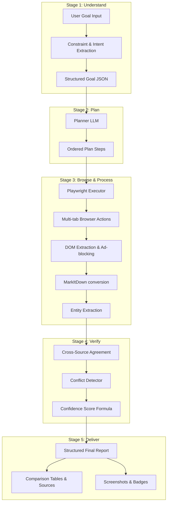

# General Autonomous Web Agent (AWA)

[](https://opensource.org/licenses/MIT)
[]()
[]()
[]()
[]()

A production-grade, modular, general-purpose autonomous web agent designed to execute tasks on the live web rather than just reading static search results. Controlled programmatically using Playwright and driven by a multi-stage LLM reasoning pipeline, this agent is built to browse websites, click elements, extract DOM contents, clean HTML to markdown, cross-verify sources, and generate structured intelligence reports.

---

## 🗺️ Architectural Pipeline

The AWA is structured as a **5-stage modular pipeline** that separates task formulation, step-by-step navigation planning, browser action execution, data cleanup/parsing, and source verification.



---

## ✨ Features

* **General Navigation**: Autonomously performs searches, clicks, scrolls, and inputs across multiple domain contexts (retail, academia, finance, etc.).
* **Intelligent Planning**: Evaluates complex instructions and generates discrete browser execution steps before loading the browser.
* **Multi-Tab Execution**: Dynamic multi-tab handling to allow concurrent parsing and cross-referencing.
* **Content Cleanup**: Standardizes web content into clean Markdown utilizing Microsoft's `MarkItDown` library, removing trackings, ads, navbars, and headers.
* **Source Verification**: Calculates agreement between multiple web sources to prevent hallucination.
* **Structured Deliverables**: Generates final Markdown reports, raw tabular comparisons, verified sources, and screenshots.

---

## 🛠️ Technology Stack

* **Backend**: Python 3.11+, FastAPI (REST API orchestration), Playwright (headless browser control), Microsoft MarkItDown (HTML to Markdown translation), Pydantic (data schemas and serialization).
* **Frontend**: React, TypeScript, Vite, TailwindCSS (for responsive UI and modern dashboards).
* **Database & Storage**: SQLite (local session and history state cache).
* **Testing & Quality**: Ruff (linting), Black (formatting), Pytest (unit and integration suites).

---

## 📁 Repository Structure

The codebase is partitioned strictly by ownership to ensure development isolation for the 4-member team.

```
.
├── backend/
│   ├── integration/     # Owned by Member A (Integration Lead) - FastAPI, LLM abstraction, Router
│   ├── browser/         # Owned by Member B (Browser Specialist) - Playwright driver, Tab/DOM capture
│   └── processing/      # Owned by Member C (Processing Specialist) - Ad block, MarkItDown, Verification
├── frontend/            # Owned by Member D (Frontend Developer) - React UI & Dashboard
├── shared/              # Frozen Pydantic schemas, shared constants, and validator contracts
├── docs/                # Design documents, APIs, Coding guidelines, and Agent guides
├── tests/               # Pytest directories mapped to each module context
├── scripts/             # Setup and deployment helper scripts
└── configs/             # Ruff, Pytest, and dotenv configurations
```

---

## 🚀 Getting Started

### Prerequisites

Ensure you have Python 3.11+ and Node.js 18+ installed on your system.

### Installation

1. **Clone the Repository**
   ```bash
   git clone https://github.com/your-org/autonomous-web-agent.git
   cd autonomous-web-agent
   ```

2. **Set up the Backend**
   ```bash
   # Create a virtual environment
   python -m venv venv
   source venv/bin/activate  # On Windows: venv\Scripts\activate

   # Install dependencies
   pip install -r backend/requirements.txt
   playwright install
   ```

3. **Set up the Frontend**
   ```bash
   cd frontend
   npm install
   ```

### Running the Application

* **Start Backend Dev Server**:
  ```bash
  uvicorn backend.integration.main:app --reload --port 8000
  ```
* **Start Frontend Dev Server**:
  ```bash
  cd frontend
  npm run dev
  ```

---

## 👥 Engineering Team & Ownership

This project employs a zero-conflict git branch policy. Review [docs/CONTRACT.md](file:///c:/Users/rehan/Desktop/autonomous-web-agent-vibecode/docs/CONTRACT.md) for direct protocols.

| Team Member | Role | Primary Scope | Directory Target |
| :--- | :--- | :--- | :--- |
| **Member A** | Integration Lead / Master | FastAPI API endpoints, LLM drivers, Shared Schemas, Merges, CI/CD | `backend/integration/`, `shared/` |
| **Member B** | Browser Specialist | Playwright actions, scrolling, clicking, multi-tab orchestration | `backend/browser/` |
| **Member C** | Processing Specialist | Ad-blocking, DOM clean, Markdown conversion, Verification pipeline | `backend/processing/` |
| **Member D** | Frontend Engineer | Interactive dashboard, plan visualize, markdown render, report view | `frontend/` |

---

## 🗺️ Roadmap

- [ ] **Phase 1 (MVP)**: Basic 5-stage pipeline, single-agent planner, basic tabular display.
- [ ] **Phase 2 (Enhancements)**: Advanced context filtering, semantic token optimization, interactive user interruptions.
- [ ] **Phase 3 (Enterprise)**: Human-in-the-loop approvals, proxy rotating, multi-agent cooperative plans (8-stage pipeline).
