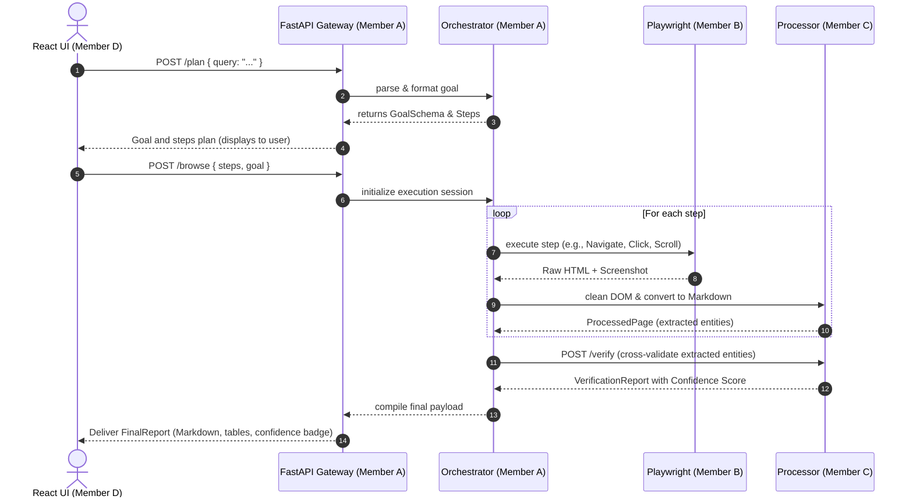
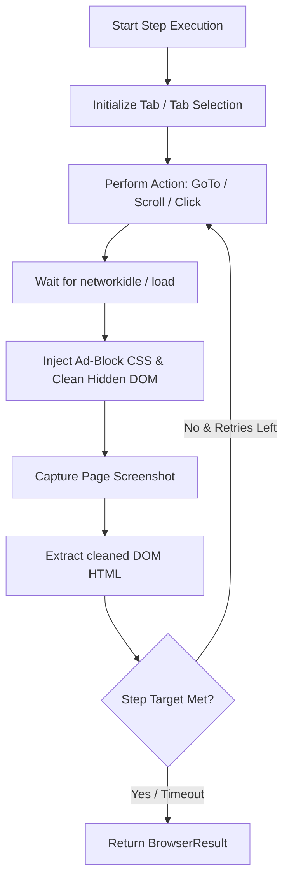
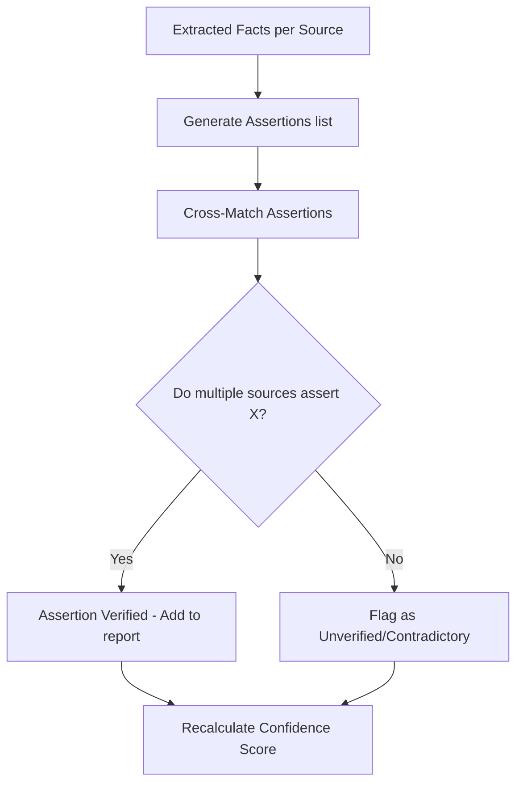
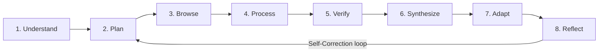

# Architectural Blueprint: Autonomous Web Agent (AWA)

This document describes the architectural philosophy, execution pipelines, data lifecycle, optimization strategies, and future roadmap of the General Autonomous Web Agent.

---

## 🏛️ Architectural Philosophy

The design of the Autonomous Web Agent relies on three core tenets:

1. **Strict Stage Separation**: Each step in the processing pipeline is atomic and isolated. The planner does not access the browser; the browser does not call LLMs; the post-processor does not navigate. Separation ensures debuggability, clean unit testing, and minimal code churn.
2. **Schema-Driven State (Contracts)**: There is no implicit state. All stages pass data strictly via validated Pydantic models. A phase can be serialized, persisted, and reloaded seamlessly.
3. **Context Token Hygiene**: LLM operations are cost-bounded. The agent implements aggressive HTML cleanup, ad blocking, CSS strip-out, and Markdown minification to reduce token waste and stay within LLM context window limitations.

---

## 🗺️ Component Diagram

The system components are decoupled to ensure developers can run code isolated from other scopes. 

```mermaid
graph TD
    subgraph Client Layer
        FE[React Frontend]
    end

    subgraph Orchestration Layer (Member A)
        API[FastAPI Gateway]
        LLM[LLM Service Abstraction]
        Orch[State Machine Orchestrator]
    end

    subgraph Action Layer (Member B)
        PW[Playwright Driver]
        Tabs[Multi-Tab Manager]
    end

    subgraph Data & Extraction Layer (Member C)
        Clean[DOM Clean & AdBlock]
        MD[MarkItDown Parser]
        Verify[Verification Engine]
    end

    subgraph Shared Contract
        Schemas[Pydantic Frozen Schemas]
    end

    FE <-->|REST API JSON| API
    API <--> Orch
    Orch <--> LLM
    Orch -->|BrowserCommand| PW
    PW -->|Raw HTML & Screenshots| Tabs
    Tabs -->|Raw HTML| Clean
    Clean -->|Clean HTML| MD
    MD -->|Clean Markdown| Verify
    Verify -->|Confidence Report| Orch
    
    Orch -.->|Validates| Schemas
    PW -.->|Validates| Schemas
    Verify -.->|Validates| Schemas
```

---

## 🔄 The 5-Stage Pipeline

The execution sequence transitions monotonically through the following 5 stages:

```
[Understand] ──> [Plan] ──> [Browse & Process] ──> [Verify] ──> [Deliver]
```

### Stage 1 — Understand
* **Inputs**: Raw unstructured user query, URL suggestions, constraints.
* **Process**: LLM parses the input, extracts the core objective, explicit constraints (e.g., "Exclude Amazon"), and implicit goals.
* **Output**: `GoalSchema` (frozen Pydantic JSON).

### Stage 2 — Plan
* **Inputs**: `GoalSchema`.
* **Process**: Planner LLM evaluates the goals and builds a sequential list of steps (e.g., search Google, browse first three results, compare prices). No browser actions occur in this phase.
* **Output**: `List[PlanStep]`.

### Stage 3 — Browse & Process
* **Inputs**: `List[PlanStep]`.
* **Process**: Playwright initiates a browser session. For each step:
  * Page loads, scrolling/clicking occurs.
  * Ad-blockers discard metrics and trackers.
  * DOM is cleaned of `<style>`, `<script>`, SVG, and metadata.
  * Markdown conversion renders text context.
  * LLM extracts target entities.
* **Output**: `List[BrowserResult]`, `List[ProcessedPage]`.

### Stage 4 — Verify
* **Inputs**: `List[ProcessedPage]`.
* **Process**: Evaluates cross-source agreement. Checks assertions from Source A against assertions from Source B.
* **Output**: Confidence score calculated using:
  $$\text{confidence} = \frac{\text{agreeing\_sources}}{\text{total\_sources}}$$
* **Output**: `VerificationReport`.

### Stage 5 — Deliver
* **Inputs**: Final verified results and screenshots.
* **Process**: Synthesizes tabular comparison layouts, sources bibliography, and confidence badges.
* **Output**: `FinalReport` (structured JSON + Markdown UI format).

---

## 🔀 Request Lifecycle & Sequence Diagram



---

## 🔄 Browser Execution Loop

The browser operates on an execution loop designed to handle dynamic single-page applications, overlays, cookie banners, and dynamic lazy-loading.



### Context Cleaning Details
To optimize data payload sizes, Stage 3 enforces strict preprocessing rules:
* Stripping script, style, head, iframe, form, svg, path, pathing attributes.
* Compressing spacing and carriage returns.
* Passing the remainder to `MarkItDown` for clean semantic content.

---

## 🛡️ Verification Flow & Hallucination Prevention

AWA prevents hallucination by cross-verifying facts across distinct domains.



1. **Assertion Extraction**: A lightweight LLM extracts simple fact vectors `[entity, attribute, value]` from each processed page.
2. **Cross-source Comparison**: Values for the same attribute of an entity are grouped and compared.
3. **Score calculation**: If 3 sources are consulted, and 2 state the price is \$500 while 1 states \$550, the \$500 assertion receives a confidence of 0.66, and the \$550 assertion is flagged as a conflict.

---

## ⚡ Token Optimization Flow

Standard web pages are bloated, often containing 500KB+ of DOM text, which translates to ~125,000 tokens. AWA reduces this by up to **95%** using a pipeline before sending text to the LLM.

| Cleanup Stage | Typical Size (KB) | Reduction | Details |
| :--- | :--- | :--- | :--- |
| Raw Web Page | 500 KB | 0% | Full HTML, JS, CSS, SVG |
| DOM Cleaner | 50 KB | 90% | Removes scripts, styles, SVGs, header/footer boilerplate |
| MarkItDown | 15 KB | 97% | Converted to pure markdown |
| Target Extractor | 2 KB | 99.6% | Extracting relevant section matching the active PlanStep |

---

## 🔮 Roadmap: The 8-Stage Vision

Future iterations of AWA will transition from a linear 5-stage pipeline to an 8-stage self-correcting agent loop:



* **Stage 6 — Synthesize**: Combines verified facts into a multidimensional database.
* **Stage 7 — Adapt**: Re-evaluates target plan based on newly discovered web structural changes (e.g. captcha blockers).
* **Stage 8 — Reflect**: Analyzes token efficiency and page-path lengths post-delivery, logging path metrics to optimize subsequent runs.
