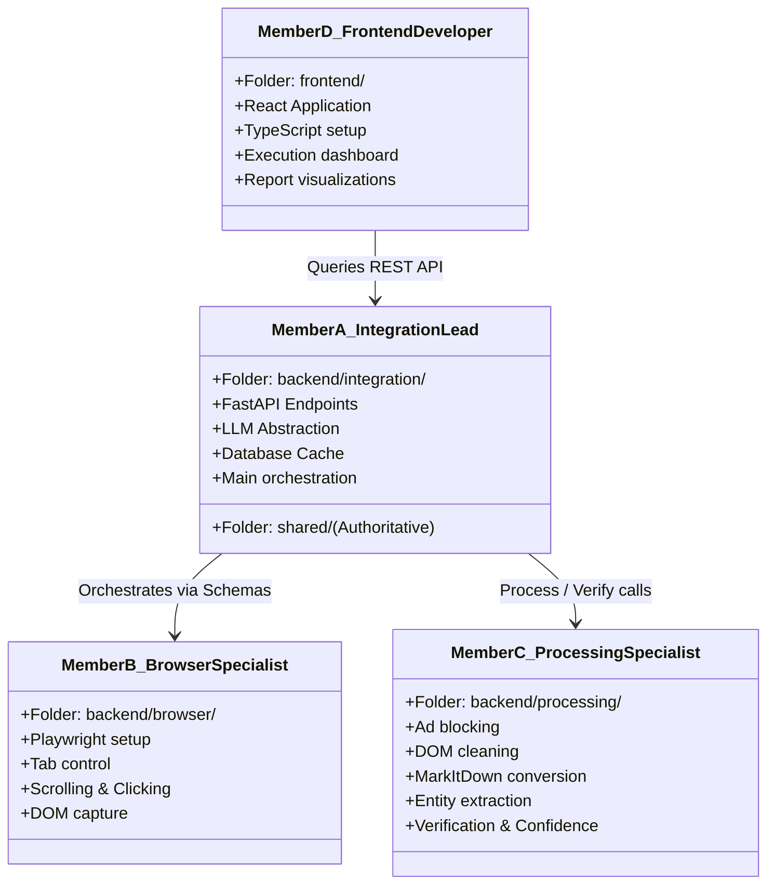

# Team Engineering Contract: General Autonomous Web Agent

This contract is a formal agreement between the four engineering members of this hackathon project. It enforces development isolation, schema-based communication, and rigorous quality standards to prevent merge conflicts and enable simultaneous independent progress.

---

## 👥 Ownership & Boundaries



| Member | Directory Scope | Forbidden Directories | Key Inputs / Expected Outputs |
| :--- | :--- | :--- | :--- |
| **Member A**<br>*(Integration)* | `backend/integration/`<br>`shared/`<br>`configs/`<br>`scripts/` | `backend/browser/`<br>`backend/processing/`<br>`frontend/` | **Inputs**: Frontend requests<br>**Outputs**: Main FastAPI runner, LLM clients, state-machine loop, system SQLite cache |
| **Member B**<br>*(Browser)* | `backend/browser/` | `backend/integration/`<br>`backend/processing/`<br>`frontend/`<br>`shared/` | **Inputs**: `BrowserCommand` step list<br>**Outputs**: `BrowserResult` containing raw HTML, screenshot paths, status codes |
| **Member C**<br>*(Processing)* | `backend/processing/` | `backend/integration/`<br>`backend/browser/`<br>`frontend/`<br>`shared/` | **Inputs**: Raw HTML payload, schema properties<br>**Outputs**: `ProcessedPage` (Markdown, entities) and `VerificationReport` |
| **Member D**<br>*(Frontend)* | `frontend/` | `backend/` (all)<br>`shared/` | **Inputs**: API endpoints (`/plan`, `/browse`, etc.)<br>**Outputs**: TypeScript React build, state visualizer, report rendering |

---

## ⚡ Golden Rules of Collaboration

1. **Strict Sandboxing**: No team member may edit, write, or modify code inside a folder owned by another member, unless explicitly requested by the Integration Lead (Member A).
2. **Schema-Only Communication**: All modules must communicate exclusively via the structured schemas defined in the `shared/` directory. 
3. **Zero Cross-Module Python Imports**: 
   * `backend/browser` **must never** import from `backend/processing` or `backend/integration`.
   * `backend/processing` **must never** import from `backend/browser` or `backend/integration`.
   * Cross-dependencies are handled exclusively by the orchestrator in `backend/integration` importing those modules as black-box functional units.
4. **Main Branch is Protected**: Nobody (including the Integration Lead) may commit directly to the `main` or `develop` branches. All code additions must go through feature branches and pull requests.
5. **No Hallucinated Implementations**: Keep schemas clean. If schemas require modifications, it must be requested through a ticket/proposal to Member A, who owns the `shared/` definitions.

---

## 🛡️ Git & Merge Protocols

* **Branch Prefix Rules**:
  * Member B: `feat/browser/...` or `fix/browser/...`
  * Member C: `feat/process/...` or `fix/process/...`
  * Member D: `feat/frontend/...` or `fix/frontend/...`
* **Pull Request Requirements**:
  * Every PR must target `develop`.
  * Every PR requires **at least one** review from a developer unaffected by the changes, and final review/approval by the Integration Lead (Member A).
  * Automated linting and tests must pass before the merge button is enabled.

---

## ✅ Definition of Done (DoD)

A pull request will not be merged unless it meets all of the following requirements:

* **Type Annotation**: 100% of new functions and variables must have explicit Python type hints (or TypeScript types in the frontend). No `Any` types without detailed comments.
* **Format & Lint Standards**: Ruff check must return zero errors. Code must comply with standard PEP8 rules enforced in the `configs/` file.
* **Logging Compliance**: Absolutely no `print()` statements in backend code. All outputs must go through the standard Python `logging` library, specifying appropriate log levels (`DEBUG`, `INFO`, `WARNING`, `ERROR`).
* **Test Coverage**: Every new feature must be accompanied by unit tests in the `tests/` directory matching the module name. Test suites must pass locally.
* **Docstring Requirements**: All classes and public functions must document parameters, return values, and exceptions raised using the Google Python Docstring style:
  ```python
  def clean_dom(raw_html: str, strip_images: bool = True) -> str:
      """Strips unnecessary tags and metadata from raw HTML.

      Args:
          raw_html: The dirty HTML string from the browser.
          strip_images: If True, filters out  elements.

      Returns:
          A cleaned HTML string containing only readable content elements.

      Raises:
          ValueError: If the raw_html is empty or invalid.
      """
  ```
* **Schema Conformance**: Inputs and outputs of public interfaces must perfectly map to Pydantic objects defined in the shared package.
