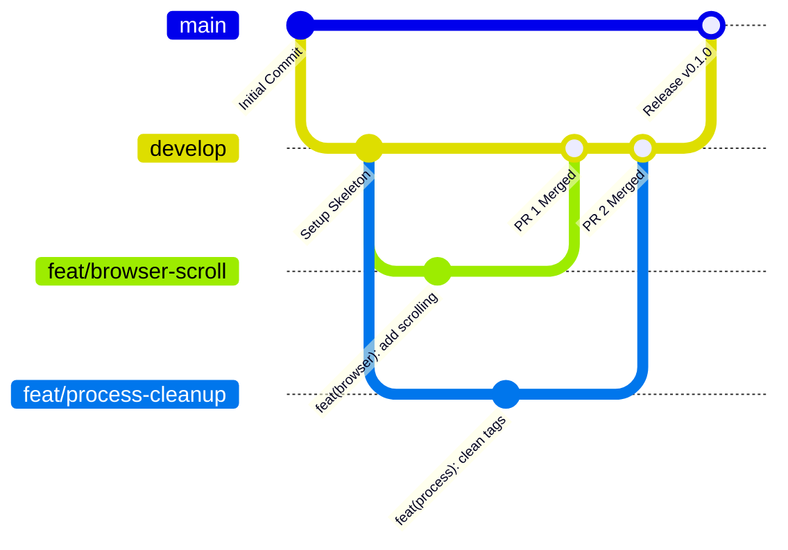
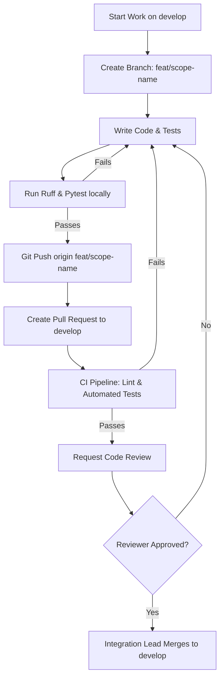

# Git Workflow Guidelines

To ensure stable, simultaneous development without merge conflicts, all team members must adhere to this Git workflow.

---

## 🗺️ Git Branch Architecture



### 1. Protected Branches

* **`main`**: Represents production-ready code. Commits can never be pushed directly to `main`. Merges to `main` happen only from `develop` during major milestones, signed off by the Integration Lead (Member A).
* **`develop`**: The primary integration branch. All feature branches target `develop` for testing. Commits can never be pushed directly to `develop`.

### 2. Feature & Bugfix Branches

All active work happens in short-lived branches created from `develop`. Branches must be prefixed according to ownership scope:

* **Member A (Integration)**: `feat/integration/*` or `fix/integration/*`
* **Member B (Browser)**: `feat/browser/*` or `fix/browser/*`
* **Member C (Processing)**: `feat/process/*` or `fix/process/*`
* **Member D (Frontend)**: `feat/frontend/*` or `fix/frontend/*`

Example branch names:
* `feat/browser-scrolling`
* `fix/process-markdown-parse`
* `feat/frontend-dashboard`

---

## 📝 Commit Naming Conventions

All commits must follow the **Conventional Commits** standard. This enables automated changelog generation and structured histories.

### Format

```
<type>(<scope>): <description>
```

* **`<type>`**: Must be one of the following:
  * `feat`: A new feature implementation.
  * `fix`: A bug fix.
  * `docs`: Documentation changes only.
  * `style`: Code style changes (formatting, missing semicolons - no logic changes).
  * `refactor`: Code changes that neither fix a bug nor add a feature.
  * `perf`: Performance improvements.
  * `test`: Adding or correcting tests.
  * `chore`: Maintenance tasks, package manager updates.
  * `ci`: CI configuration changes.
* **`<scope>`**: Represents the component affected (`browser`, `process`, `integration`, `frontend`, `schemas`).
* **`<description>`**: Imperative, present-tense description in lowercase (no capital letter at start, no period at end).

### Examples

* 👍 `feat(browser): add multi-tab switching driver`
* 👍 `fix(process): handle unclosed tags in parser`
* 👍 `docs(api): specify POST /verify status codes`
* 👍 `test(integration): add validation for happy path uvicorn runs`

---

## 🔄 PR & Merge Lifecycle



### Steps to Merge

1. **Pull and Rebase**: Before pushing, pull `develop` and rebase your branch on it to resolve conflicts locally:
   ```bash
   git checkout develop
   git pull origin develop
   git checkout feat/my-scope
   git rebase develop
   ```
2. **Local Verification**: Ensure formatting (`ruff format .`), linting (`ruff check .`), and tests (`pytest`) pass.
3. **Push & Create PR**: Push your branch to the remote and open a PR targeting `develop`.
4. **Code Review**: At least one other team member must review the PR code. The reviewer should check code against the [docs/CONTRACT.md](file:///c:/Users/rehan/Desktop/autonomous-web-agent-vibecode/docs/CONTRACT.md) Definition of Done.
5. **Approval & Merge**: Once approved and CI passes, the Integration Lead will merge the PR.
